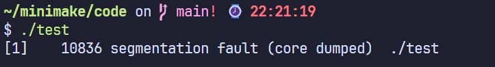

# 笔记

## makefile语法规则
[makefile语法规则](https://www.bilibili.com/video/BV1tyWWeeEpp/?spm_id_from=333.337.search-card.all.click&vd_source=34d0f8835a0912d9914f5e0c76e83fd1)

## 一些库函数的笔记
- strchr 是C标准库中的一个字符串处理函数，用于在字符串中查找指定字符的第一次出现位置。

~~~c
#include <string.h>
char *strchr(const char *str, int c);
// 参数说明
// str: 要搜索的字符串（const char *类型）
// c: 要查找的字符（int类型，实际使用时会转换为char）
// 返回值
// 成功: 返回指向第一次出现字符c的指针
// 失败: 返回NULL（未找到指定字符）
~~~

- fgets()函数的工作原理：

>从文件中读取一行（遇到'\n'或EOF停止）
将读取的内容（包括换行符'\n'）存储到字符数组中
自动在末尾添加空字符'\0'

- memove

- strtok

- memset

- access() 用于“用调用进程的真实用户/组ID”测试文件的存在性与访问权限，不改变文件，不打开文件。

~~~C
// 头文件
#include <unistd.h>
#include <errno.h>

// 原型
int access(const char *pathname, int mode);

// mode 取值（可按位或）
// F_OK 是否存在 (existence)
// R_OK 读权限 (read)
// W_OK 写权限 (write)
// X_OK 执行/搜索权限 (execute/search)
// 示例：
if (access("data.txt", F_OK) == 0) { /* 存在 */ }
if (access("script.sh", R_OK | X_OK) == 0) { /* 可读并可执行 */ }

// 返回值
// 0 表示全部测试通过
// -1 表示失败，并设置 errno

// 常见 errno
// ENOENT 路径中某一部分或文件不存在
// ENOTDIR 路径中要求是目录的部分不是目录
// EACCES 权限不足（包含目录的执行(遍历)权限不足）
// EROFS 只读文件系统上请求写权限
// ELOOP 符号链接循环
// ENAMETOOLONG 路径过长
// EFAULT 指针非法（用户空间外）
// EINVAL mode 无效（很少见，一般自己拼错）
~~~

- stat

> 1. 作用:获取文件的元数据（类型、权限、大小、时间戳等），不读取文件内容。
> 2. time_t st_mtime: 最近内容修改时间（构建系统常用）

~~~C
#include <sys/stat.h>
#include <stdio.h>

int main() {
    struct stat st;
    if (stat("Makefile", &st) != 0) { // 成功返回0，失败返回-1
        perror("stat");
        return 1;
    }
    if (S_ISREG(st.st_mode))
        printf("size=%ld mtime=%ld\n", (long)st.st_size, (long)st.st_mtime);
    return 0;
}
~~~

## Kahn算法

- 算法流程

> 1. 计算每个节点的入度（有多少条边指向它）。
> 2. 将所有入度为 0 的节点加入队列（或栈）。
> 3. 当队列非空时：
取出一个节点 u，加入拓扑序列。
遍历 u 的所有邻接节点 v：
将 v 的入度减 1。
如果 v 的入度变为 0，将 v 加入队列。
> 4. 如果最终拓扑序列中的节点数 ≠ 总节点数 → 图中存在环，不是 DAG。

~~~
L ← 空列表（存储拓扑排序结果）
S ← 所有入度为 0 的节点的集合（可用队列/栈）

while S 非空:
    取出节点 u 从 S 中
    将 u 加入 L
    for 每个 u 的邻接节点 v:
        入度[v] 减 1
        if 入度[v] == 0:
            将 v 加入 S

if L 中的节点数 < 总节点数:
    return "图中存在环，无法拓扑排序"
else:
    return L
~~~

# 遇到的难点

1. 阶段二任务一解析makefile时一直发生图中错误，最后发现是因为将这么大的目标块数组放在栈上会导致栈溢出（`Target_block 中 commands[1000][1000]`，改为在堆上分配内存解决

